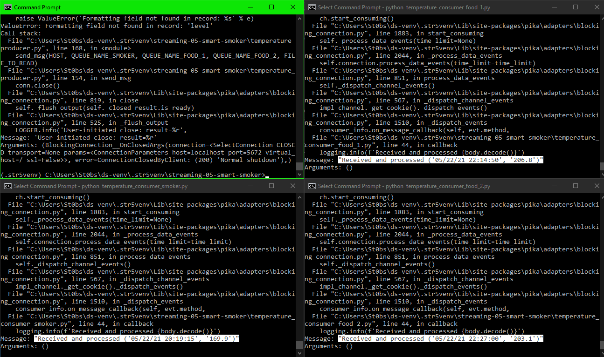

# streaming-05-smart-smoker
> Example of streaming data from one publisher (producer) to multiple consumers via a queue.

### Author: Solomon Stevens
### Date: May 31, 2024

## Prerequisites
* RabbitMQ Installed and running on your machine
* Pika installed and running on Python

## How it works
* Timestamps and temperatures are read in from `smoker-temps.csv` by `temperature_producer.py`
* Temperatures are separated by channel (column) and sent to respective queues

## Screenshot

